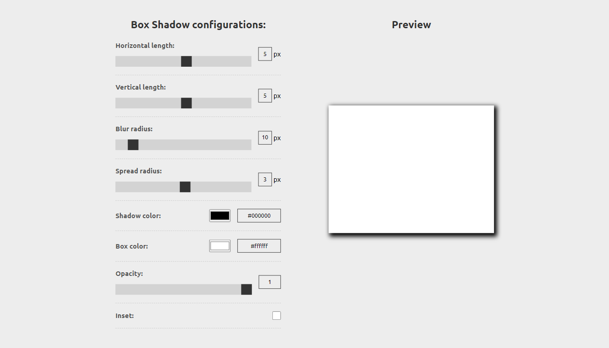
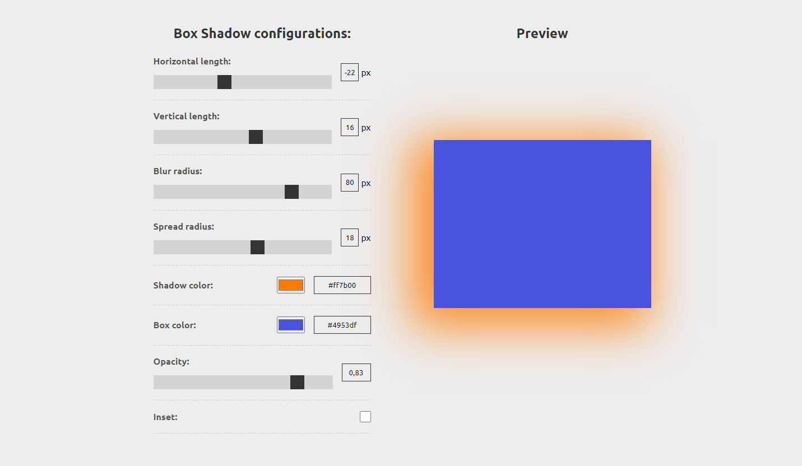
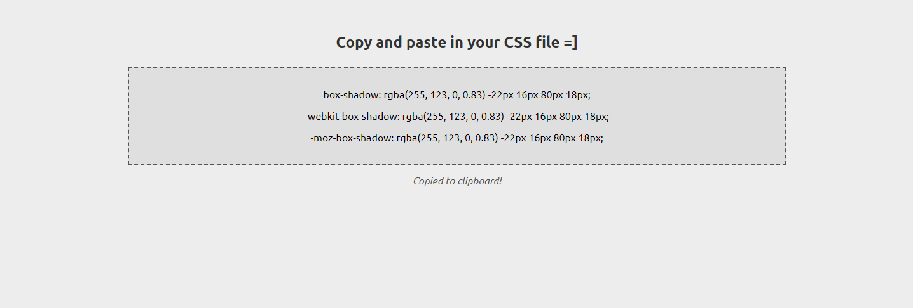

# Box Shadow Generator

A simple box shadow generator made with HTML, CSS and JavaScript. In it, you can manipulate the vertical and horizontal length of the shadow, its blur and spread radius, color and opacity. In addition, it is also possible to change the color of the box and select internal shading.

The software also provides a box that copies the generated CSS rules to your clipboard when clicked. This way, you can easily paste the rules into your code.

## How to use

1. Clone this repository

2. Open the `index.html` file in your browser.

3. Play with the options.

4. Click on the box to copy the CSS rules to your clipboard.

